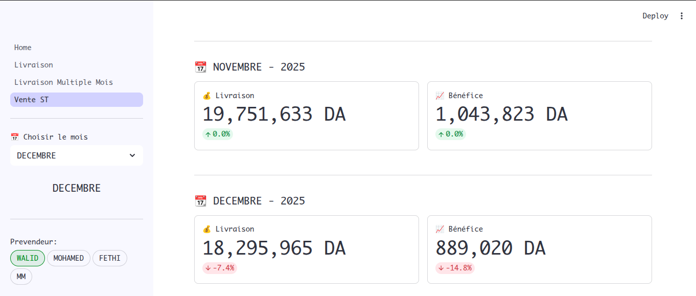
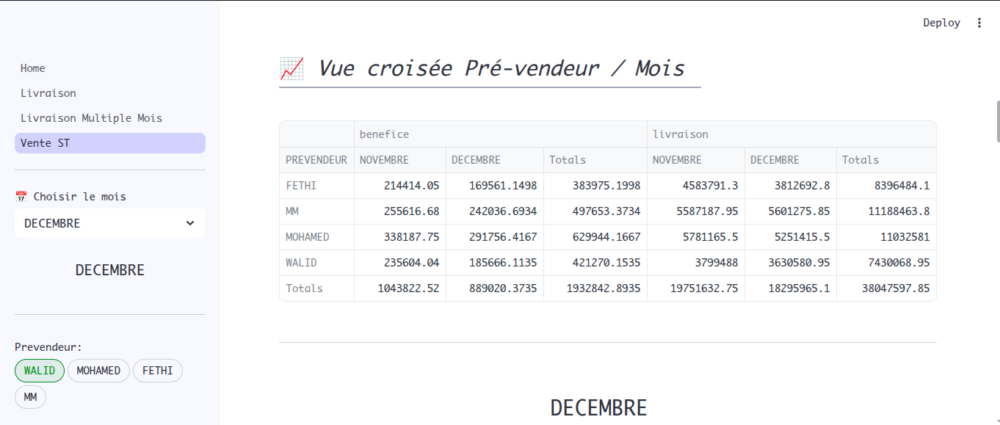
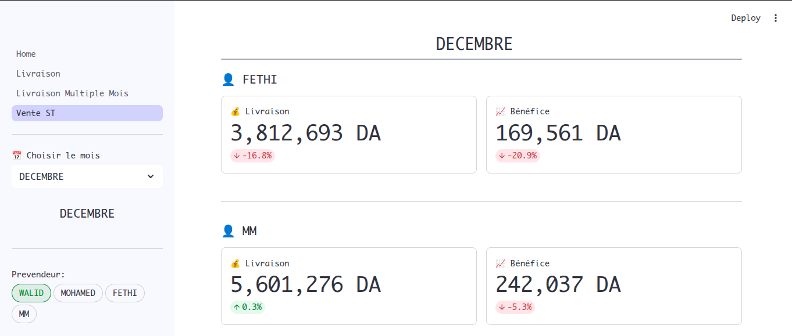
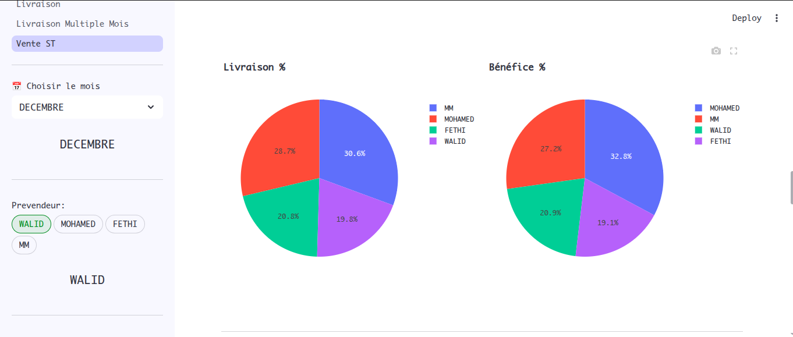
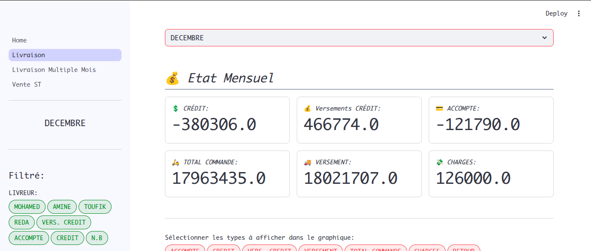
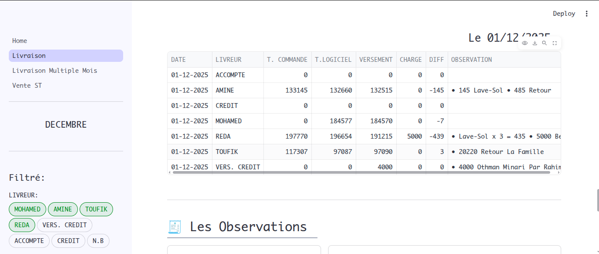
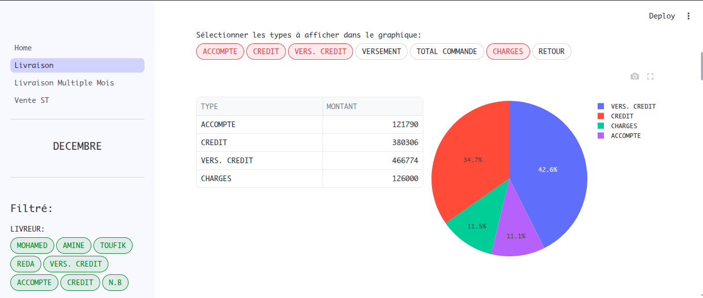

# 📊 Tableau de bord Streamlit – TrizStock

Ce projet est un **tableau de bord interactif développé avec Streamlit** permettant d’analyser et de visualiser les données exportées depuis l’application **TrizStock** à partir de fichiers Excel.

Le dashboard facilite le suivi des ventes, versements, charges et commandes à travers des graphiques clairs et des statistiques automatiques.

---

## 🚀 Fonctionnalités

- Importation de fichiers Excel issus de **TrizStock**
- Nettoyage et traitement automatique des données
- Agrégation mensuelle des données
- Graphiques interactifs (courbes, barres, statistiques)
- Tableaux récapitulatifs
- Interface simple et intuitive avec Streamlit

---

## 🛠️ Technologies utilisées

- **Python 3**
- **Streamlit**
- **Pandas**
- **Plotly / Matplotlib**
- **Excel (.xlsx)**

---

## 📸 Captures d’écran TrizStock

### Vue générale du dashboard

### Tableau croisé dynamique

### État pré-vendeur

### Pourcentage des livraisons et du bénéfice

---

## 📄 Format du fichier Excel (TrizStock)

- Le tableau de bord vente attend un fichier Excel des produits sorties de TrizStock:

## 📸 Captures d’écran Versement Livreuer

### État Mensuel

### État Journalier

### État des charges, acomptes et crédits – Versement crédit

- Le tableau de bord Versement attend un fichier excel avec les colonnes suivantes :

### Exemple de données :

| DATE           | LIVREUR      | T. COMMANDE    | T. LOGICIEL | VERSEMENT    | CHARGE   | DIFF    | OBSERVATION |
|----------------|--------------|----------------|-------------|--------------|----------|---------|-------------|
| Thursday 01-01 | MOHAMED      |                | 161,036.00  | 161,036.00   |          | 0.00     | 600000 - 161036 = 438964 |
| Thursday 01-01 | AMINE        | 151,165.00     | 151,165.00  | 150,665.00   | 500.00   | 0.00     | -500 Gasoil |
| Thursday 01-01 | TOUFIK       | 300,940.00     | 300,940.00  | 299,130.00   | 1,800.00 | (10.00)  | 1800 Contrôle Technique |
| Thursday 01-01 | REDA         | 314,487.00     | 314,487.00  | 314,355.00   |          | (132.00) | 
| Thursday 01-01 | CREDIT       |                | (28,935.00) |              |          |          | 12420 Boughrassa (Toufik), 
|                 |               |                 |              |               |           |          | 16515 Wahab Gouraya (Reda) |
| Thursday 01-01 | VERS. CREDIT |                | 8,265.00    |              |          |          | 8265 AG Mekaoui Ali (Reda) |
| Thursday 01-01 | ACCOMPTE     |                | 0.00        |              |          |          | |
| Thursday 01-01 | N.B          |                | 400.00      |              |          |      | 400 Vente au Dépos |
|                | **TOTAL**    | **904,916.00** |             | **2,300.00** | **(142.00)** |      | |

📌 Un fichier exemple est disponible dans :
`./example_data/2026-VERSEMENT_LIVREUR_2026.xlsx`
